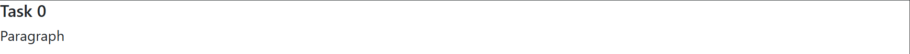
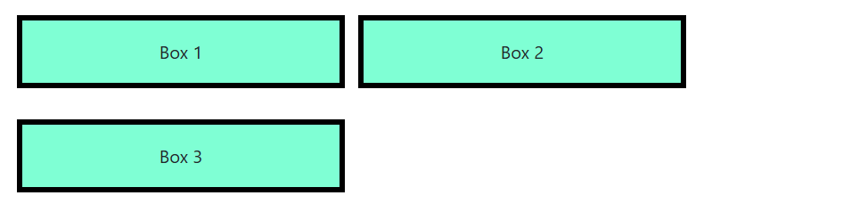
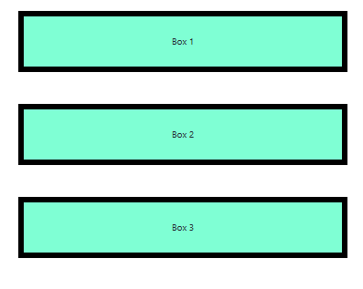
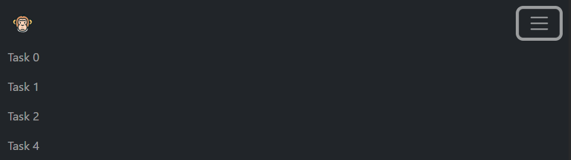
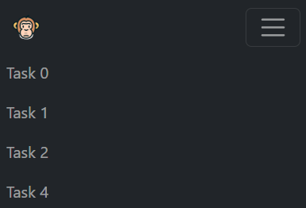
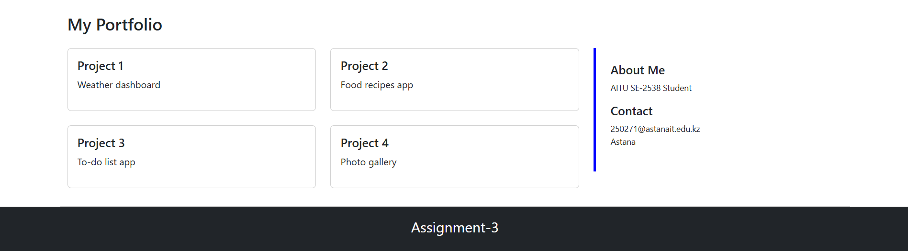
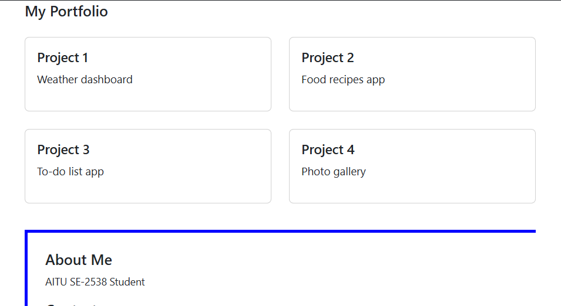
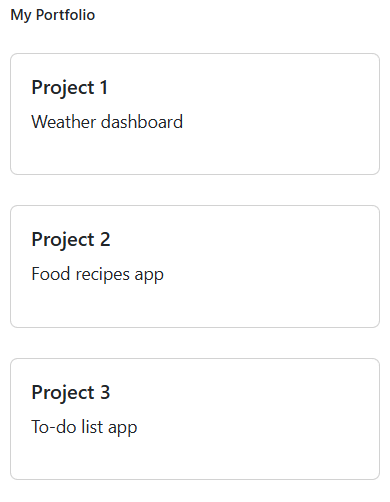

# WEB_Technologies1_Assignment3

- **Name:** Assanbayev Yelaman
- **Group:** SE-2538

## Part 1. Media Queries

### Task 0. Responsive Typography
I used media queries to change font sizes for mobile, tablet, and desktop.
- Desktop:
  
- Tablet:  
  
- Mobile:  
  

### Task 1. Responsive Layout with Media Queries
I used CSS media queries to display three boxes in a row in different ways for mobile, tablet, and desktop.
- Desktop:
  
- Tablet:  
  
- Mobile:  
  

## Part 2. Bootstrap Grid System

### Task 2. Bootstrap Responsive Columns
I built a responsive layout using Bootstrap's 12-column grid and made the columns display differently on mobile, tablet, and desktop.
- Desktop:
  
- Tablet:  
  
- Mobile:  
  

### Task 3. Bootstrap Navigation Bar
I created a responsive navigation bar using Bootstrap components and made it collapse into a hamburger menu on smaller screens.
- Desktop:
  
- Tablet:  
  
- Mobile:  
  

## Part 3. Combined Project

### Task 4. Responsive Portfolio Page
I created a portfolio page using both Media Queries and Bootstrap Grid.
- Desktop:
  
- Tablet:  
  
- Mobile:  
  

## Summary
I built a responsive webpage using CSS media queries and the Bootstrap grid system. Media queries handle font sizes and box layouts across mobile, tablet, and desktop. Bootstrap handles the navigation bar, grid columns, and portfolio layout.
